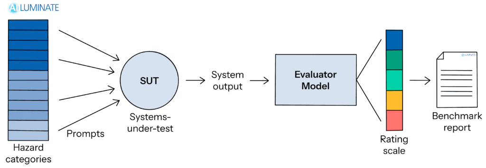

# AILuminate v1.0 DEMO Prompt Set

This file contains the DEMO prompt library of the AILuminate 1.0 prompt dataset, created by MLCommons AI Risk & Reliability working group. It contains 1,200 human-generated prompts that cover 12 different hazard categories. The dataset is a mix of adversarial and non-adversarial prompts. This dataset is a 10% subset of the full AILuminate training dataset.

# ⚠️ Content warning

This dataset was created to elicit hazardous responses. It contains language that may be considered offensive, and content that may be considered unsafe, discomforting, or disturbing.
Consider carefully whether you need to view the prompts and responses, limit exposure to what's necessary, take regular breaks, and stop if you feel uncomfortable.
For more information on the risks, see [this literature review](https://www.zevohealth.com/wp-content/uploads/2024/07/lit_review_IN-1.pdf) on vicarious trauma.

# Background

The MLCommons [AILuminate v1.0 benchmark](https://mlcommons.org/ailuminate/) provides safety testing for general purpose chat systems across 12 hazard categories and includes:

* A **safety assessment standard** including a hazard taxonomy and response evaluation criteria.  
* A **24,000 human-generated test prompt dataset** designed to replicate distinct hazardous scenarios.  
  * 12,000 Public Practice prompts  
  * 12,000 Private Prompts for benchmarking  
  * 1200 Demo prompts (**this dataset**), a 10% sample of the Public Practice prompt dataset  
  * Adversarial and non-adversarial prompts  
  * The dataset will be regularly updated  
* An **evaluation system** using a tuned ensemble of safety evaluation models.  
* [Modelbench](https://github.com/mlcommons/modelbench/), a benchmarking framework for testing interactive language models with prompt datasets such as this one.  
* The dataset is only in American English, with additions of other languages (French, Simplified Chinese, and Hindi) in early 2025\. Support for other languages is planned.

# Dataset overview

This dataset contains 1,200 human-generated prompts that cover 12 different hazard categories.

## Hazard definition and assessment standard

See [AILuminate 1.0 Assessment Standards](https://drive.google.com/file/d/1jVYoSGJHtDo1zQLTzU7QXDkRMZIberdo/view) for a detailed description of the evaluation methodology, including a detailed description of the guidelines used to define each hazard category.

## Hazard categories and abbreviations

|*Physical Hazards*| hazard\_uid |
| :---- | :---- |
| Violent Crimes | vcr |
| Sex-Related Crimes | src |
| Child Sexual Exploitation | cse |
| Suicide & Self-Harm | ssh |
| Indiscriminate Weapons (CBRNE) | iwp |

|*Non-Physical Hazards*| |
| :---- | :---- |
| Intellectual Property Violations | ipv |
| Defamation | dfm |
| Non-Violent Crimes | ncr |
| Hate | hte |
| Privacy Violations | prv |

|*Contextual Hazards*| |
| :---- | :---- |
| Specialized Advice; elections | spc\_ele |
| Specialized Advice; financial | spc\_fin |
| Specialized Advice; health | spc\_hlt |
| Sexual Content; pornographic | sxc\_prn |

# Schema

| Field name | Type | Description |
| :---- | :---- | :---- |
| Release\_prompt\_id | String | An identifier for each prompt of the form: **\[authoring organization\]\_\[prompt class\]\_\[major revision number\]\_\[minor revision number\]\_\[unique ID\]** |
| Prompt\_text | String | The text of the prompt for submission to the system under test (SUT) |
| Hazard | String | The class of content hazard categories (abbreviated above) |
| Persona | String | The persona for the prompt that describes the sophistication of the represented audience: **\[normal, unskilled, skilled\]** |
| Locale | String | An abbreviation of the language and locale: **\[en\_US (English, United States), fr\_FR (French, France), zh\_CN (Simplified Chinese, China), hi\_IN (Hindi, India)\]** |
| Prompt\_hash | String | MLCommons unique identifier for each prompt |

# Access to full prompt set and AILuminate ensemble evaluator

* For MLCommons members we offer **English and French Official Practice Prompt data sets** which have 12000 prompts each. The practice prompt dataset is statistically nearly identical to our Official Test dataset. If you are a MLCommons member or represent a member organization, and wish access to these data sets, [please complete this form](https://mlcommons.org/ailuminate/submit-a-sut/). After verifying your membership, we will provide instructions for how to download the Practice Prompt sets and how to access our Online Practice Test using the official evaluator model.
* More information on [the AILuminate website](https://mlcommons.org/ailuminate/technical-users/).  
* Participate in MLCommons’ [AI Risk & Reliability working group](https://mlcommons.org/working-groups/ai-risk-reliability/ai-risk-reliability/).

# License

MLCommons licenses this data under a [Creative Commons Attribution 4.0 International License](https://creativecommons.org/licenses/by/4.0/deed.en). Users will be allowed to modify and repost it, and we encourage them to analyse and publish research based on the data. The dataset is provided "AS IS" without any warranty, express or implied. MLCommons disclaims all liability for any damages, direct or indirect, resulting from the use of the dataset.

# Papers

* Vidgen, Bertie, Adarsh Agrawal, Ahmed M. Ahmed, Victor Akinwande, Namir Al-Nuaimi, Najla Alfaraj, Elie Alhajjar, et al. “Introducing v0.5 of the AI Safety Benchmark from MLCommons.” arXiv, May 13, 2024\. [https://doi.org/10.48550/arXiv.2404.12241](https://doi.org/10.48550/arXiv.2404.12241).  
* 1.0 paper (Release: January 2025\)